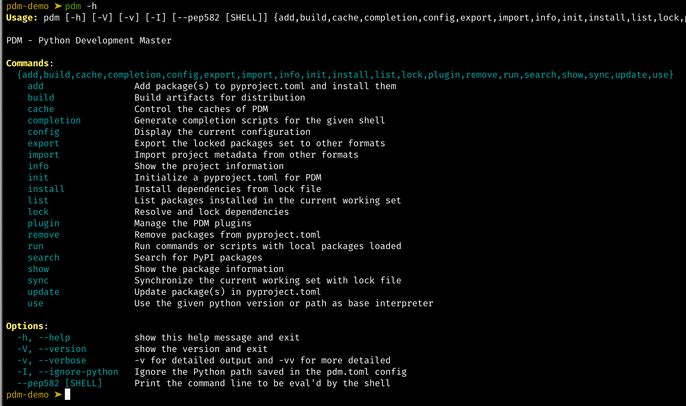

# PDM管理

## 安装

`pipx install pdm`

## 初始化

执行 pdm init 就会开始初始化，初始化的时候，会让你选择项目的一些信息

* 是否要上传 PyPI
* 依赖的 Python 版本
* License 类型
* 作者信息
* 邮箱信息

初始化项目时会把机器上的所有 Python 版本都扫描出来了，会让选择项目的 Python 版本。

完成之后，PDM 会将你的选择以 toml 格式写入 pyproject.toml 配置文件中。

## 语法

pdm 有非常多的命令，使用 `-h` 可以看到帮助菜单

### 配置pypi源

通过 `pdm config`能够修改诸多配置，它们以Key-Value的形式进行查看和修改。

修改源为中科大的pypi源

`pdm config pypi.url http://mirrors.ustc.edu.cn/pypi/web/simple`

`pdm config pypi.verify_ssl False`

### 增加依赖库

使用 `pdm add`命令能为当前目录的项目添加依赖库，如 `pdm add requests`

### 依赖库分组

添加pytest依赖，到dev环境，并加入分组test

`pdm add pytest -dG test`

### 查看依赖库

使用 `pdm list`列出当前环境 `Interpreter`已安装的包

`pdm list --tree`以树状列出依赖层级

`pdm list --freeze`以requirements格式列出

`pdm list --json`以json格式列出

### 删除依赖库

使用 `pdm remove`命令删除依赖库

### 更新依赖库

使用 `pdm update`更新所有依赖，使用 `pdm update <包名>`更新指定包

### 分组更新

更新dev依赖下test分组中的pytest包

`pdm update -dG pytest`

### 查看项目环境

使用 `pdm info`查看项目信息

### 切换解释器

使用 `pdm use`来切换Python解释器，但要满足两个条件：

1. 只能切换到当前操作系统上拥用的解释器版本，`pdm use`命令会列出所有适用的版本。
2. 在 `pdm init`时已经限制过解释器版本的哈，则只能满足该版本的前提下切换。例如：在 `pdm init`时设置过 `requires-python = ">=3.11"`，则 `pdm use`的参数也必须满足 `>=3.11`否则会失败

### 运行python命令

如果想在pdm配置的环境中，运行python命令或文件，可使用 `pdm run`

### 命令别名

pdm的命令别名配置在 `pyproject.toml`的 `[tool.pdm.scripts]`，如需快捷设置，只用编辑该模块。
